# Mobile — React Native Cross-Platform App

Readmigo Mobile is a cross-platform application built on React Native and Expo, providing a unified codebase for iOS and Android. It offers reading, vocabulary learning, and audio experiences for English learners.

## Role

Mobile is a cross-platform alternative to the native platforms (iOS, Android). It shares APIs and business logic and uses the Expo managed workflow to accelerate development iteration. Together with iOS (Swift) and Android (Kotlin), it forms a platform triangle.

## Tech Stack

- **Framework**: React Native 0.81+
- **Manager**: Expo ~54.0.30
- **Routing**: Expo Router ~6.0
- **Language**: TypeScript
- **State Management**: Zustand
- **Styling**: NativeWind (Tailwind for React Native)
- **Networking**: Axios + React Query
- **Offline Storage**: Drizzle ORM + Expo SQLite
- **Audio**: Expo AV (audio playback)
- **Push Notifications**: Expo Notifications

## Architecture

```mermaid
graph LR
    A[Expo Router] --> B[App Directory]
    B --> B1[Pages & Screens]
    B1 --> C[Components]
    C --> C1[UI Components]
    C1 --> D[Hooks & Utils]
    D --> D1[Stores/API]
    D1 --> E[Backend API]
    style A fill:#314A54
    style E fill:#FFB84D
```



| Layer | Responsibility |
|------|------|
| Expo Router | File-system based routing |
| App / Components | Pages and UI component library |
| Hooks | Custom logic hooks (data fetching, localization) |
| Stores | Zustand global state |
| API | Axios HTTP client |

## Directory Structure

```
mobile/
├── app/                            # Expo Router pages (file-based routing)
│   ├── (auth)/                     # Auth stack
│   │   ├── login.tsx
│   │   └── signup.tsx
│   ├── (main)/                     # Main app stack
│   │   ├── library.tsx             # Library
│   │   ├── reader/[bookId].tsx     # Reader
│   │   └── profile.tsx             # Profile
│   ├── _layout.tsx                 # Root layout
│   └── +html.tsx                   # Web support
├── src/
│   ├── components/                 # React Native components
│   │   ├── ui/                     # Base UI (buttons, inputs, etc.)
│   │   ├── reader/                 # Reader-specific components
│   │   └── ...
│   ├── hooks/                      # Custom logic hooks
│   │   ├── useBook.ts
│   │   ├── useAuth.ts
│   │   └── useReading.ts
│   ├── stores/                     # Zustand state management
│   │   ├── authStore.ts
│   │   ├── libraryStore.ts
│   │   └── userStore.ts
│   ├── lib/                        # Utility functions
│   │   ├── api.ts                  # Axios client
│   │   ├── db.ts                   # SQLite database
│   │   └── logger.ts               # Logging
│   └── types/                      # TypeScript type definitions
├── assets/                         # Images, fonts, localization
│   ├── images/
│   ├── fonts/
│   └── locales/
├── ios/                            # Expo managed iOS
├── android/                        # Expo managed Android
├── app.json                        # Expo configuration
├── eas.json                        # EAS Build configuration
├── package.json                    # Dependency management
└── tsconfig.json                   # TypeScript configuration
```

## Local Development

### Requirements

- **Node.js**: 18+
- **pnpm**: 8+
- **Expo CLI**: latest version (`pnpm install -g expo-cli`)
- **iOS**: Xcode 15.0+ (for testing iOS features)
- **Android**: Android Studio 2024.1+ (for testing Android)

### Install and Run

```bash
# Install dependencies
pnpm install

# Start the Expo development server
pnpm start

# Run on the iOS simulator
pnpm ios

# Run on the Android emulator
pnpm android

# Web support (limited features)
pnpm web

# Linting and type checking
pnpm lint
pnpm typecheck
```

Follow the Expo prompts to scan the QR code and test on a physical device using the Expo Go app.

## Deployment

Build and release with EAS (Expo Application Services):

```bash
# Build for iOS
eas build --platform ios

# Build for Android
eas build --platform android

# Build for both platforms
eas build --platform all

# Submit to the App Store and Google Play
eas submit --platform ios
eas submit --platform android
```

The configuration lives in `eas.json` and includes iOS signing and Android signing details.

## Environment Variables

Core environment variables (`.env` or GitHub Secrets):

- `API_BASE_URL` — backend API endpoint
- `SENTRY_DSN` — error tracking
- `POSTHOG_API_KEY` — analytics
- `HMAC_SECRET` — API request signing

## Related Repos

- **ios** — Native iOS app (Swift + SwiftUI)
- **android** — Native Android app (Kotlin + Compose)
- **api** — NestJS backend API
- **web** — Next.js web app

## Documentation

- Online docs: https://docs.readmigo.app
- Expo official docs: https://docs.expo.dev
- iOS Bundle ID: `rn.readmigo.app`
- Android Package: `com.readmigo.app`
